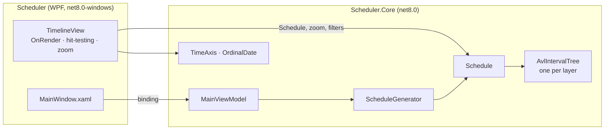

<div align="center">


# Scheduler

**A virtualized WPF timeline widget that scrolls and zooms smoothly through a million scheduled jobs.**

[](https://github.com/Staery/Scheduler/actions/workflows/ci.yml)


[](LICENSE)

**English** · [Русский](README.ru.md)

</div>

---

Scheduler shows jobs (*Pending*, *Jeopardy*, *Completed*) on a multi-row timeline with a ruler, a live **NOW** line
and hover details. Its custom `TimelineView` control **draws only what is on screen** directly into a
`DrawingContext`, and finds the visible jobs in a self-balancing **AVL interval tree**. The view stays responsive
with 1,000,000 events: only a few hundred are drawn per frame.

## 📸 Screenshots


*One million events in 100 layers: built in about a second, and each frame draws only the visible ones:*


## ✨ Features

| | |
|---|---|
| ⚡ **Virtualized rendering** | No UI element per event. Visible jobs are drawn into a `DrawingContext` with frozen brushes, and the time per frame is shown in the status bar |
| 🌳 **AVL interval tree** | Each layer is indexed by a self-balancing AVL tree augmented with the maximum end of every subtree, so the jobs in the viewport are found in O(log n + k), even when jobs overlap or share a start time |
| 🖱 **Navigation** | Wheel scrolls rows, `Shift`+wheel scrolls time, and `Ctrl`+wheel zooms around the cursor. There is a zoom slider, scroll bars, and a *Now* button that jumps to the NOW line |
| ⏱ **Live NOW line** | Play/pause with adjustable speed (1–240 minutes per second) |
| 🎛 **Status filters** | Show or hide Pending, Jeopardy and Completed jobs, with counts |
| 🧭 **Smart ruler** | Tick spacing adapts to the zoom (5 minutes to a week), and day boundaries are highlighted |
| 💬 **Hover details** | The job under the cursor is outlined, and its title, layer, time and status are shown |
| 🎲 **Realistic generator** | 1–200 layers and up to 1,000,000 jobs of 15 minutes to 3 hours. Past jobs are mostly completed, future ones pending. Generation runs off the UI thread |

## 🧱 Tech stack

| Area | Technology |
|---|---|
| Runtime | .NET 8, C# 12 |
| UI | WPF: custom `FrameworkElement` with `OnRender`, dependency properties, a custom theme and vector icons |
| Architecture | MVVM with [CommunityToolkit.Mvvm](https://learn.microsoft.com/dotnet/communitytoolkit/mvvm/); `TimeProvider` for testable time |
| Tests | xUnit, 49 tests: AVL invariants (balance, height bound, key order, max-end) and queries checked against a brute-force scan |
| CI/CD | GitHub Actions: build, test and a self-contained single-file `.exe` |

## 🏗 Architecture



**How a frame is drawn**

1. The viewport is converted to a time window `[from, to)` and a range of visible layers.
2. For each visible layer, `Schedule.Query(layer, from, to)` asks that layer's AVL interval tree for the jobs
   overlapping the window. Subtrees whose maximum end is ≤ `from` are skipped entirely, and the walk stops at the
   first job that starts at or after `to`.
3. Only those jobs are drawn, together with the grid, the ruler, the sticky layer labels and the NOW line.

## 🌳 AVL interval tree

`Scheduler.Core/Collections/AvlIntervalTree.cs` is a self-balancing binary search tree written for this project:

- **Key:** `(start, insertion order)`. Jobs with the same start time are all kept, which fixes the bug in the first
  version where the tree rejected duplicate keys.
- **Balancing:** after every insert the tree is rebalanced with single and double rotations (LL, RR, LR, RL), so its
  height stays within 1.44·log₂(n + 2). Even 100,000 inserts in sorted order produce a tree only about 17 levels deep.
- **Augmentation:** every node stores the maximum end of its subtree, which turns the AVL tree into an interval tree.

| Operation | Complexity |
|---|---|
| Insert | O(log n) |
| Jobs overlapping a time window | O(log n + k) |
| In-order traversal (sorted by start) | O(n) |

The tests check the AVL invariants after random and sorted inserts and compare every query with a brute-force scan.

### Project layout

```
Scheduler/
├── src/
│   ├── Scheduler/               # WPF app: TimelineView control, window, theme
│   └── Scheduler.Core/          # AVL interval tree, schedule, generator, time axis, view model
├── tests/Scheduler.Core.Tests/  # xUnit tests
└── .github/workflows/ci.yml
```

## 🛠 Fixes compared to the first version

- **Events were lost.** The third-party AVL tree (Bitlush) used the start time as its only key and rejected
  duplicates, so every event whose start collided with another one was silently dropped, while the
  Pending/Jeopardy/Completed counters still included it. It is replaced by the project's own AVL interval tree,
  keyed by `(start, insertion order)`.
- **Memory leak.** The ruler added new elements on every scroll and never removed the old ones.
- **Debug code in the release build.** `AllocConsole()` opened a console window, and FPS was written to it on every
  scroll.
- **Threading.** Generation on a background thread replaced the tree the UI thread was reading. Now an immutable
  schedule is built off the UI thread and swapped in.
- **Edge cases.** Zero layers or a small number of events caused a division by zero, and one extra event was created
  per layer.
- The NOW line moved by a fixed 0.4 px every 10 ms, regardless of zoom. It now moves in timeline minutes.

## 🚀 Getting started

Requirements: Windows 10/11 and the [.NET 8 SDK](https://dotnet.microsoft.com/download/dotnet/8.0).

```bash
git clone https://github.com/Staery/Scheduler.git
cd Scheduler
dotnet run --project src/Scheduler
```

```bash
dotnet test tests/Scheduler.Core.Tests   # runs on any OS
```

| Input | Action |
|---|---|
| Wheel / `Shift`+wheel | Scroll layers / time |
| `Ctrl`+wheel | Zoom around the cursor |
| `Ctrl+G` | Generate a new schedule |
| `Ctrl+Space` | Play / pause the NOW line |

## 📄 License

[MIT](LICENSE) © 2024–2026 Anton Selkin
