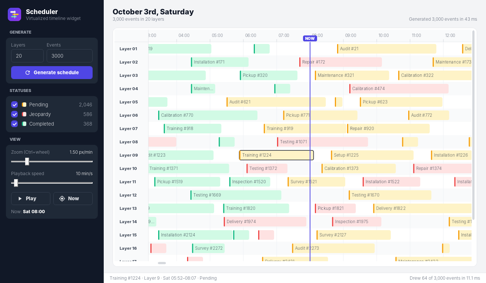
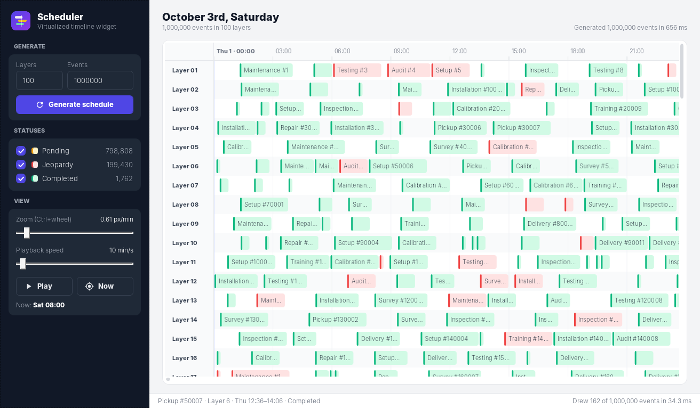
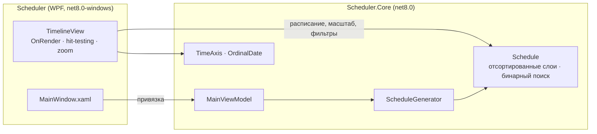

<div align="center">


# Scheduler

**Виртуализированный WPF-виджет таймлайна, который плавно прокручивает и масштабирует миллион запланированных задач.**

[](https://github.com/Staery/Scheduler/actions/workflows/ci.yml)


[](LICENSE)

[English](README.md) · **Русский**

</div>

---

Scheduler показывает задачи (*Pending*, *Jeopardy*, *Completed*) на многострочном таймлайне с линейкой времени,
движущейся линией **NOW** и подсказками при наведении. Собственный контрол `TimelineView` **рисует только то, что
видно на экране**, прямо в `DrawingContext`, а видимые задачи находит бинарным поиском. Интерфейс остаётся отзывчивым
даже при 1 000 000 событий: за кадр рисуются лишь несколько сотен.

## 📸 Скриншоты



*Миллион событий в 100 слоях: генерация занимает меньше секунды, а за кадр рисуются только видимые:*



## ✨ Возможности

| | |
|---|---|
| ⚡ **Виртуализированная отрисовка** | Никаких UI-элементов на каждое событие. Видимые задачи рисуются в `DrawingContext` замороженными кистями, а время кадра показывается в строке состояния |
| 🔎 **Поиск видимых задач за O(log n)** | Каждый слой — отсортированный массив без пересечений, поэтому задачи в области просмотра находятся бинарным поиском |
| 🖱 **Навигация** | Колесо прокручивает слои, `Shift`+колесо — время, `Ctrl`+колесо масштабирует вокруг курсора. Есть ползунок масштаба, полосы прокрутки и кнопка *Now*, которая переходит к линии NOW |
| ⏱ **Живая линия NOW** | Запуск и пауза, скорость настраивается (от 1 до 240 минут в секунду) |
| 🎛 **Фильтры статусов** | Показ и скрытие задач Pending, Jeopardy и Completed со счётчиками |
| 🧭 **Умная линейка** | Шаг делений подстраивается под масштаб (от 5 минут до недели), границы дней выделены |
| 💬 **Подсказки** | Задача под курсором обводится, показываются её название, слой, время и статус |
| 🎲 **Реалистичный генератор** | От 1 до 200 слоёв и до 1 000 000 задач длительностью от 15 минут до 3 часов. Прошедшие задачи в основном выполнены, будущие ожидают. Генерация идёт вне UI-потока |

## 🧱 Технологии

| Область | Технологии |
|---|---|
| Платформа | .NET 8, C# 12 |
| Интерфейс | WPF: собственный `FrameworkElement` с `OnRender`, свойства зависимостей, своя тема и векторные иконки |
| Архитектура | MVVM на [CommunityToolkit.Mvvm](https://learn.microsoft.com/dotnet/communitytoolkit/mvvm/); `TimeProvider`, чтобы время подменялось в тестах |
| Тесты | xUnit, 43 теста, включая сверку бинарного поиска с полным перебором |
| CI/CD | GitHub Actions: сборка, тесты и самодостаточный `.exe` из одного файла |

## 🏗 Архитектура



**Как рисуется кадр**

1. Область просмотра переводится в окно времени `[from, to)` и диапазон видимых слоёв.
2. Для каждого видимого слоя `Schedule.Query(layer, from, to)` бинарным поиском находит первую задачу, которая
   заканчивается после `from`, и идёт вперёд, пока задачи начинаются раньше `to`.
3. Рисуются только эти задачи, а также сетка, линейка, закреплённые подписи слоёв и линия NOW.

### Структура проекта

```
Scheduler/
├── src/
│   ├── Scheduler/               # WPF-приложение: контрол TimelineView, окно, тема
│   └── Scheduler.Core/          # Расписание, генератор, ось времени, ViewModel
├── tests/Scheduler.Core.Tests/  # Тесты xUnit
└── .github/workflows/ci.yml
```

## 🛠 Исправления по сравнению с первой версией

- **Терялись события.** AVL-дерево из Bitlush не принимает повторяющиеся ключи, поэтому каждое событие с
  совпадающим временем начала молча отбрасывалось, а счётчики Pending/Jeopardy/Completed его всё равно учитывали.
- **Утечка памяти.** Линейка при каждой прокрутке добавляла новые элементы и никогда не удаляла старые.
- **Отладочный код в релизной сборке.** `AllocConsole()` открывал окно консоли, и в него на каждую прокрутку писался
  FPS.
- **Многопоточность.** Генерация в фоновом потоке подменяла дерево, которое в это время читал UI-поток. Теперь
  неизменяемое расписание строится вне UI-потока и подставляется целиком.
- **Краевые случаи.** Ноль слоёв или малое число событий приводили к делению на ноль, а в каждом слое создавалось
  на одно событие больше.
- Линия NOW сдвигалась на фиксированные 0,4 px каждые 10 мс независимо от масштаба. Теперь она движется в минутах
  таймлайна.

## 🚀 Быстрый старт

Нужны Windows 10/11 и [.NET 8 SDK](https://dotnet.microsoft.com/download/dotnet/8.0).

```bash
git clone https://github.com/Staery/Scheduler.git
cd Scheduler
dotnet run --project src/Scheduler
```

```bash
dotnet test tests/Scheduler.Core.Tests   # работает на любой ОС
```

| Ввод | Действие |
|---|---|
| Колесо / `Shift`+колесо | Прокрутка слоёв / времени |
| `Ctrl`+колесо | Масштаб вокруг курсора |
| `Ctrl+G` | Сгенерировать новое расписание |
| `Ctrl+Space` | Запустить / остановить линию NOW |

## 📄 Лицензия

[MIT](LICENSE) © 2024–2026 Anton Selkin
